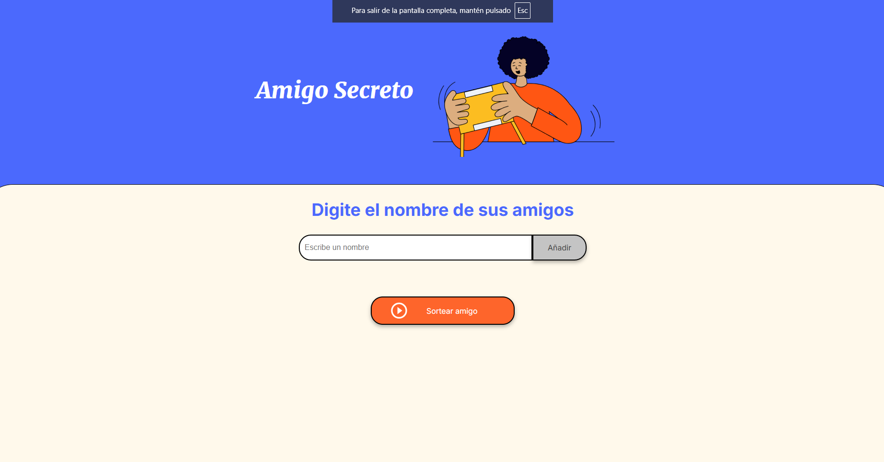
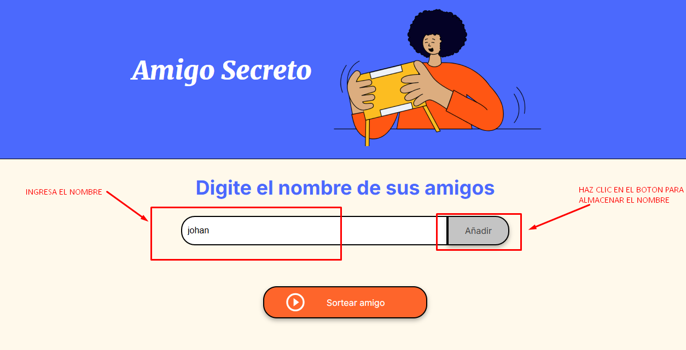
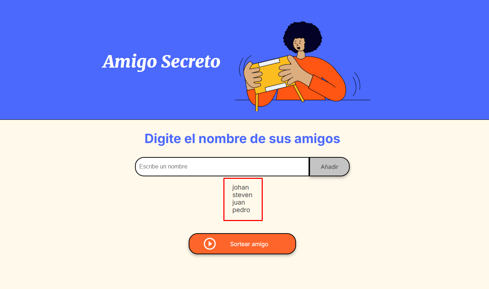
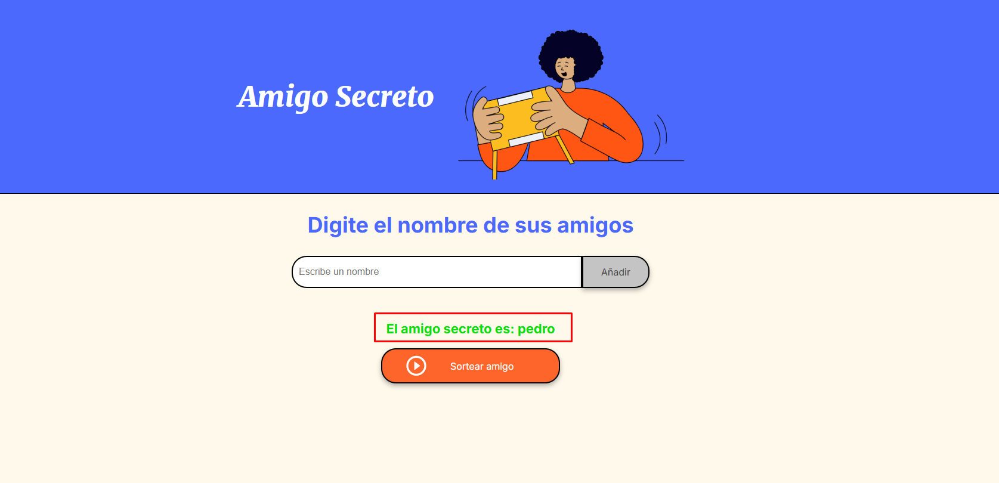

# Challenge Amigo Secreto

Este proyecto es una aplicación para sortear un AMIGO SECRETO de un listado que previamente hayas ingresado.

## Características

- Registro de participantes.
- Asignación aleatoria de amigos secretos.

## Instalación

1. Clona este repositorio:
    ```bash
    git clone https://github.com/tu-usuario/challenge-amigo-secreto.git
    ```
2. Navega al directorio del proyecto:
    ```bash
    cd challenge-amigo-secreto
    ```
3. Abre el archivo index.html en tu navegador.

## Uso

1. Aparece la siguiente pantalla:



2. En el cuadro de texto se agregan uno por uno los nombres a sortear y se añaden con el botón como se indica en la imagen.



3. Después de ir agregando los nombres, aparecerán en la parte inferior en forma de lista.



4. Cuando ya esté completo el listado, podemos dar clic en el botón "Sortear amigo" y nos mostrará en letras verdes el amigo sorteado.



## Licencia

Este proyecto es de uso libre. ¡Siéntete libre de mejorarlo y compartirlo! 🚀
